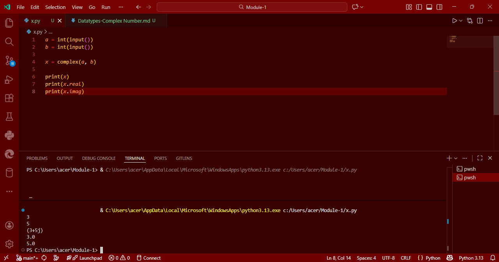

# Datatypes-Complex Number Creation in Python

## Aim
To write a Python program that reads two integers, creates a complex number using them, and then prints the complex number along with its real and imaginary parts.

## Algorithm
1. Read an integer input from the user and assign it to the variable `a` (real part).
2. Read another integer input from the user and assign it to the variable `b` (imaginary part).
3. Create a complex number `x` using the `complex(a, b)` function.
4. Print the complex number `x`.
5. Print the real part of `x` using `x.real`.
6. Print the imaginary part of `x` using `x.imag`.

## Program
```
a = int(input())
b = int(input())

x = complex(a, b)

print(x)
print(x.real)
print(x.imag)
```

## Output


## Result
The program successfully reads two integers, creates a complex number, and prints the complex number along with its real and imaginary parts.